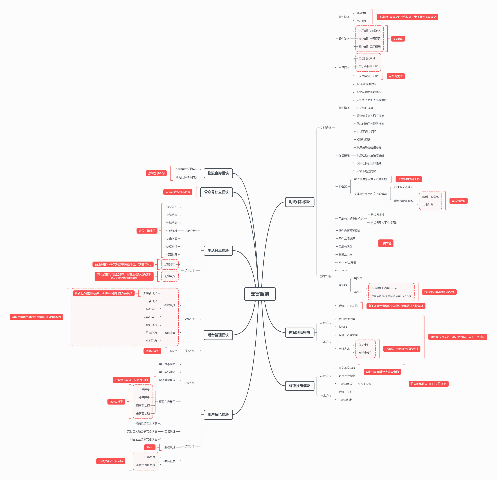

# 工程简介
> 开发：© By JanYork
### 整体功能设计

### 模块分析

> 1. 时光邮件模块
> 2. 匿名短信模块
> 3. 许愿投币模块
> 4. 用户角色模块
> 5. 后台管理模块
> 6. 生活分享模块
> 7. 公众号独立模块
> 8. 物流查询模块

#### 时光邮件模块

主要功能为发信，包含实体信件付费投递、电子邮件免费投递功能，支付方式主要为微信支付。

> **注：实体信件强制用户实名认证**

#### 匿名短信模块

主要功能为匿名短信发送，使用非营销短信（营销短信会默认丢入垃圾信息），但是缺陷就是，只能使用短信模板，需要发送一个标识前往官网、公众号或小程序取信，而不能直接内容展示到短信。

使用非直接展示的方式好处在于不限制匿名短信字数与某些在内容上合规短信上不合规的内容。

> **注：匿名短信强制用户实名认证**

#### 许愿投币模块

主要功能为支付后在许愿墙展示自己的愿望，支持评论祝福和点赞，支付金额为1￥。

具体业务逻辑不在此展出。

> **注：许愿模块强制登录后使用**

#### 用户角色模块

主要作用为鉴权和认证，采用`RBAC`权限模型，构建用户角色来实现对应权限的分发。

如果微信一键登录，将自行创建默认用户以及默认信息。

#### 后台管理模块

后台管理模块配合用户角色模块，不同权限对不同的数据有着不同的操作权限，超级管理员默认为最高一级权限。

#### 生活分享模块

此模块定位为微社区模块，支持发布分享、点赞和评论等，预计支持海报分享（小程序无）。

#### 公众号独立模块

后续可扩展一些内容，未认证情况下接口较少，比如实现发送匿名信的取信码获取信件内容。

> **注：认证后可实现微信扫码登录等**

#### 物流查询模块

物流查询模块可提供实体信件的物流跟踪服务。

> **注：此模块必须登录且实名**

### 技术架构

- 采用`MyBatisPlus`实现`CRUD`操作
- 采用`Shiro`实现`RBAC`权限模型
- 采用`SpringBoot`作为基础框架
- 采用`Redis`作为NoSQL缓存数据库
- 采用`RedisCache`实现数据缓存
- 采用`JWT`实现用户登录状态
- 采用`Swagger`实现接口文档
- 采用`Maven`作为项目管理工具
- 采用`MySQL`作为数据库
- 采用腾讯云`cos`作为文件存储
- 采用腾讯云短信服务实现匿名短信
- 采用`Hutool`工具包作为基础工具类
- 采用`Lombok`简化代码
- 采用微信支付SDK3版本实现支付功能
- 采用`SpringBoot`自带的`Tomcat`作为服务器
- 采用百度文本AI实现敏感词及敏感内容过滤

### 整体网站设计
- 采用前后端分离部署设计
- 前端使用`Nuxt3`实现`SSR`，优化`SEO`
- 小程序采用`uniapp`实现多端适配
- 后端采用`SpringBoot`实现`RESTful`接口
- 后端采用`JWT`生成`token`作为登录状态令牌
- 后端采用`Redis`作为`token`缓存

### 其他说明
本套系统不考虑并发场景。